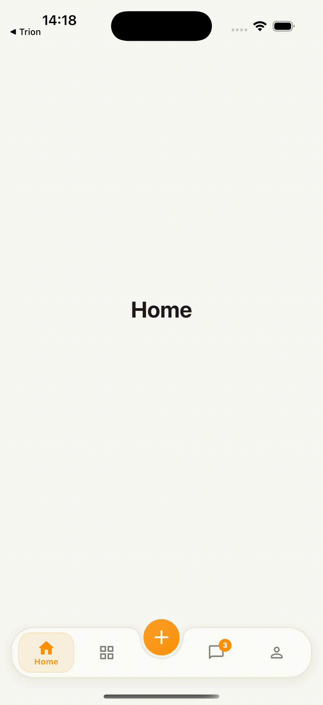

# Center Action Navbar

A customizable Flutter bottom navigation bar with a floating center action
button, notched pill container, and smooth selection animations.

## Preview

<!--
Add a screenshot or GIF under screenshots/ and uncomment the line below:


-->

## Features

- Floating center action button that rises above the bar
- Soft notched pill container
- Customizable navigation items with active/inactive icons
- Sliding selection highlight and icon animations
- Optional badges on items
- Theme-based colors, typography, and sizing
- Responsive layout (no fixed screen width)
- No third-party dependencies
- Material 3 friendly
- Works on Android, iOS, Web, macOS, Windows, and Linux

## Installation

```yaml
dependencies:
  center_action_navbar: ^0.1.0
```

```bash
flutter pub get
```

## Import

```dart
import 'package:center_action_navbar/center_action_navbar.dart';
```

## Basic Usage

```dart
int currentIndex = 0;

Scaffold(
  body: pages[currentIndex],
  bottomNavigationBar: CenterActionNavbar(
    currentIndex: currentIndex,
    items: const [
      CenterActionNavbarItem(
        icon: Icons.home_outlined,
        activeIcon: Icons.home,
        label: 'Home',
      ),
      CenterActionNavbarItem(
        icon: Icons.grid_view_outlined,
        activeIcon: Icons.grid_view,
        label: 'Modules',
      ),
      CenterActionNavbarItem(
        icon: Icons.chat_bubble_outline,
        activeIcon: Icons.chat_bubble,
        label: 'Messages',
      ),
      CenterActionNavbarItem(
        icon: Icons.person_outline,
        activeIcon: Icons.person,
        label: 'Profile',
      ),
    ],
    centerAction: const Icon(Icons.add),
    onCenterActionTap: () {
      // Handle center action.
    },
    onTap: (index) {
      setState(() => currentIndex = index);
    },
  ),
);
```

Use an **even** number of items so the center action sits between equal left
and right groups (for example 2, 4, or 6).

## Customization

```dart
CenterActionNavbar(
  currentIndex: currentIndex,
  items: items,
  onTap: onTap,
  onCenterActionTap: onCenterActionTap,
  theme: const CenterActionNavbarTheme(
    backgroundColor: Colors.white,
    selectedColor: Colors.deepOrange,
    unselectedColor: Colors.grey,
    height: 62,
    borderRadius: 28,
    centerActionSize: 45,
    centerActionOffset: 12,
  ),
);
```

## Center Action

The floating button is shown by default. Customize its child and callback:

```dart
CenterActionNavbar(
  currentIndex: currentIndex,
  items: items,
  onTap: onTap,
  centerAction: const Icon(Icons.add_rounded),
  centerActionTooltip: 'Create',
  onCenterActionTap: () {
    // Open a sheet, dialog, or route from your app.
  },
);
```

Hide it when needed:

```dart
CenterActionNavbar(
  currentIndex: currentIndex,
  items: items,
  onTap: onTap,
  showCenterAction: false,
);
```

## Example

See the runnable sample in the [`example`](example) directory:

```bash
cd example
flutter run
```

## Contributing

Issues and pull requests are welcome. Please keep the public API focused on UI
only (no routing or state-management dependencies), preserve the default visual
design unless a change is intentional, and include tests for behavioral changes.

## License

MIT License. See [LICENSE](LICENSE).
